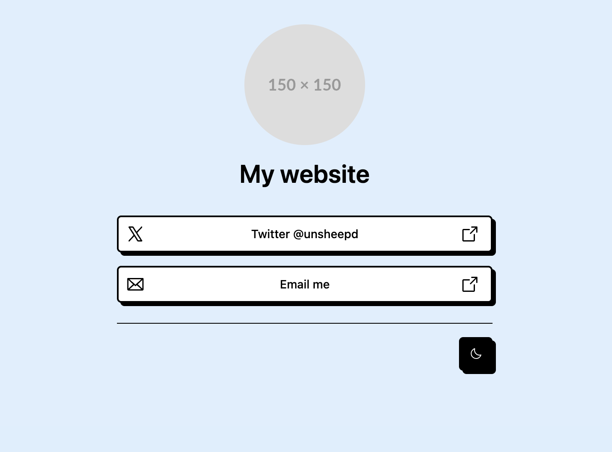

# Astro Personal Website via Powerups.dev

## What is powerups.dev

Powerups are customizable boilerplates for your agents.

## What is this powerup for?

Create a personal website with Astro and the brutalism UI style. Add social buttons, analytics, and more in seconds through your agent and the powerup framework.

## How to use this powerup

Run the following commands:

```bash
# Install the powerup
npx @liolocs/powerups-cli install npm:@liolocs/astro-personal-website

# Use the powerup
npx @liolocs/powerups-cli use @liolocs/astro-personal-website --project-name=my-website --name="My Website" --site-description="My personal website" --twitter-handle=unsheepd --email "some@email.com"
```

Running the above commands will create a new astro project, and running the dev server will result in:



## Available variables for this powerup:

camelCase variables can be passed in the terminal with dashes e.g. `--project-name=my-website`

| Variable | Description | Required | Default |
| --- | --- | --- | --- |
| projectName | The name of your project | Yes | |
| name | The name of your website, used in the meta tags | Yes | |
| siteDescription | The description of your website, used in the meta tags | Yes | |
| twitterHandle | Your twitter handle | No | |
| linkedinHandle | Your linkedin handle | No | |
| youtubeHandle | Your youtube handle | No | |
| githubHandle | Your github handle | No | |
| email | Your email address | No | |
